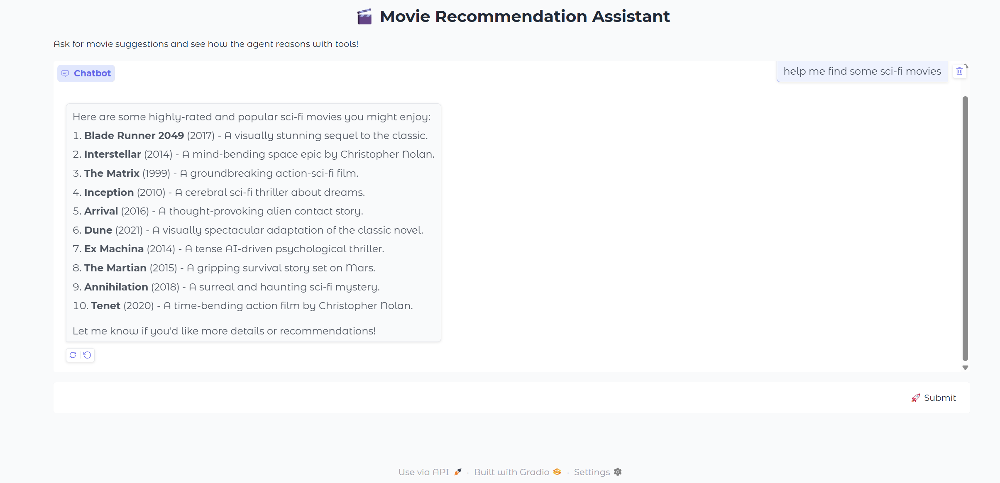
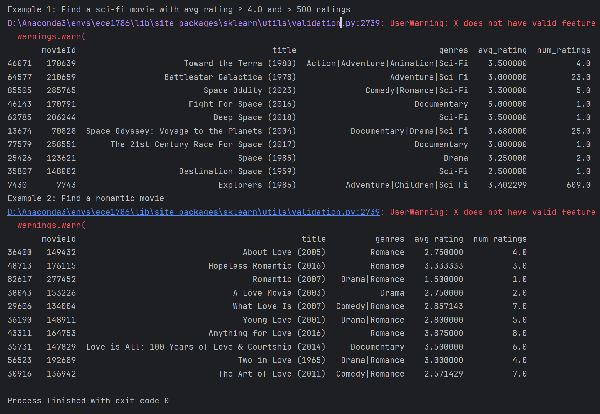

# LLM-based Recommendation Systems enhanced by RAG

## Overview
This project is a **Retrieval-Augmented Generation (RAG) based movie recommendation system** built using **GPT-4o mini, DeepSeek-V3, FAISS, and LangChain**. It retrieves movies from the **MovieLens dataset** and generates structured, contextualized recommendations.

## Features
- **Semantic Retrieval**: Uses **FAISS** to find similar movies based on user queries.
- **LLM-based Recommendation**: Generates movie suggestions and explanations using **GPT-4o and DeepSeek-V3**.
- **Hybrid Filtering**: Combines **metadata filtering, embedding-based retrieval, and ranking** to refine recommendations.
- **API Integration**: Exposes endpoints for external usage via **Flask or FastAPI**.

## Installation
```bash
# Clone the repository
git clone https://github.com/ZenanJ/ECE1508.git
cd ECE1508

# Install dependencies
pip install -r requirements.txt
```

## Configuration
Modify `src/utils/config.py` to update hyperparameters, API keys, and retrieval settings.

Create `.env` file based on the `.env.sample` file content.
```bash
cp .env.sample .env
```
And input your API secret key in the `.env` file.


## Usage
### Run in Gradio UI mode
```bash
python src/app.py --mode ui --model remote --llm openai
```
The chatbot interface will be available at `http://localhost:7860`.

### Run in command-line mode
```bash
python src/app.py --mode cli --model remote --llm openai
```

## Repository Structure
```
ECE1508/
│── evaluation/                 # evaluation method and test data
│── images/                     # example images
│── movielens_data/             # Directory for dataset storage
│   ├── raw/                    # Raw MovieLens dataset files
│   ├── processed/              # Preprocessed data and embeddings
│── src/                        # Main source code
│   ├── retrieval/              # Retrieval system (FAISS, embeddings)
│   │   ├── index_builder.py    # Build FAISS index
│   │   ├── retriever.py        # Retrieve similar movies from index
│   ├── generation/             # LLM-based response generation
│   │   ├── prompt_templates.py # Define structured prompts for GPT-4o & DeepSeek-V3
│   │   ├── generator.py        # Generate movie recommendations using LLM
│   ├── utils/                  
│   │   ├── config.py           # configuration file where load API key from .env file
│   ├── app.py                  # Using Gradio build a chatbot interface
│── .env.sample                 # sample format for .env file
│── requirements.txt            # Required dependencies
│── README.md                   # Project documentation
```

## Examples
### Gradio Chatbot Interface


### Retrieved Results Directly from FAISS vectorDB

